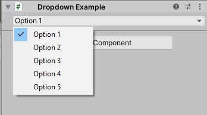
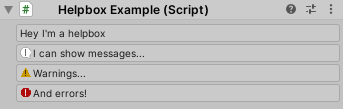
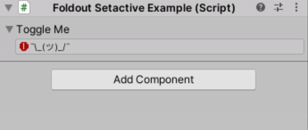
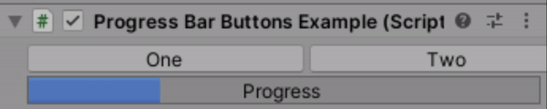

# Stupid.UwU [](LICENSE) [](http://stupidplusplus.com)
`Making GUI as easy as [Header()]!`


## First off...
#### What is UwU?
UwU is a super easy to use library for Unity that enables you to make your scripts look as beautiful as ever WITHOUT having to write a custom editor. 

#### Why not use custom editors?
Custom editors are incredibly versatile but they usually require you to create an additional script or class, create serialized properties for all the fields you want to show, link it to your original script, etc. It can be a lot of hassle. 

UwU is here to cut out the middle man. It attempts to make every script feel beautiful, without compromise and in half the time it would usually take.

#### How does UwU work?
UwU uses something called Attributes. Perhaps you've used one before in the form of putting ```[Header("")]``` above a variable to give it a title. UwU attempts to make all its featured GUI elements as easy to use as this.

## Features
UwU uses ```UnityEngine.GUI```, ```UnityEngine.GUILayout```, ```UnityEditor.EditorGUI```, ```UnityEditor.EditorGUILayout``` and attempts to feature the most useful of their methods. The following methods are supported:

 - Seperating lines➖
 - Labels🔖
 - Titles (Same as ```[Header("")]``` but with more options)
 - Dropdowns🔽
 - HelpBoxes⬜
 - SetActives (Basically ```[HideInInspector]``` but dependant on a boolean in your script)
 - Foldouts🔽
 - Progress bars [█░░░ 25%]
 - Horizontal and Vertical groups 
 - Buttons (And yes they can actually call functions) 🔴
 - A lorum ipsum generator and a dad joke generator 👨🏻
 - Some other tomfoolery...

 ## Examples
#### Dropdown
```cs
    [Dropdown(new object[] { "Option 1", "Option 2", "Option 3", "Option 4", "Option 5" })]
    public string DropDown0 = "Option 1";
```


#### HelpBox
```cs
    [HelpBox]
    public string helpbox1 = "Hey I'm a helpbox";
    [HelpBox(1, MessageType.Info)]
    public string helpbox2 = "I can show messages...";
    [HelpBox(1, MessageType.Warning)]
    public string helpbox3 = "Warnings...";
    [HelpBox(1, MessageType.Error)]
    public string helpbox4 = "And errors!";
```


#### Foldout and Setactive
```cs
    [FoldOut]
    public bool toggleMe = false;

    [SetActive("toggleMe"), HelpBox(1, MessageType.Error)]
    public string shrug = Funny.shrug;
```


#### Button, Progressbar and Horizontal layout group
```cs
    [BeginHorizontal, Button("One")]
    public bool one;
    [EndHorizontal, Button("Two")]
    public bool two;

    [ProgressBar(0, 100)]
    public float progress;
```


 ## Q&A
`How do I use UwU?`

Simply download the unity package from the releases tab or copy the sourcecode directly from this repository and drag it into the Unity assets folder of your project. You can then write ```using Stupid.UwU;``` on the top of your script and start using attributes to make your scripts look beautiful. Try out some of the examples above and see the magic happen!

`Does UwU affect in-editor performance?`

No, UwU does not affect in-editor performance. However because we're using attributes and attributes need to be compiled along with the script, the compile time may be slightly longer however this effect will only become noticable when you use +30 or so attributes.

`Does UwU completely replace custom editors?`

No, although UwU is super easy to use it, because of the limitations of attributes, lacks in complexity. Once there is a demand for more complex custom inspectors UwU starts to become a less preferable alternative to writing your own custom inspector.

`Is UwU build safe?`

Yes! This is actually another benefit of using UwU over your own custom inspectors. You won't have to put scripts that use UwU in an `Editor` folder or use ```#if UNITY_EDITOR``` on anything that uses UwU. 